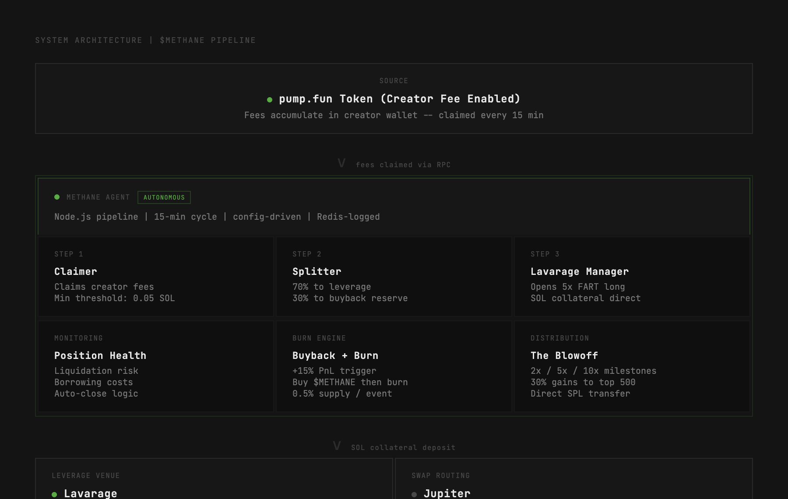

# $METHANE — Gas as a Service

**Open-source infrastructure that turns idle pump.fun creator fees into leveraged Fartcoin exposure.**

Every mechanic is on-chain and verifiable. No custody, no pooling, no trust assumptions beyond the smart contracts themselves.

[](https://www.methane.capital)
[](https://www.methane.capital/docs)
[](LICENSE)

---

## Table of Contents

- [Overview](#overview)
- [How It Works](#how-it-works)
- [Architecture](#architecture)
- [The Pipeline](#the-pipeline)
- [Why Lavarage](#why-lavarage)
- [Token Mechanics](#token-mechanics)
- [API Reference](#api-reference)
- [Live Dashboard](#live-dashboard)
- [Risk Assessment](#risk-assessment)
- [Tech Stack](#tech-stack)
- [Environment Variables](#environment-variables)
- [Development](#development)
- [Deployment](#deployment)
- [Contributing](#contributing)
- [License](#license)

---

## Overview

Fartcoin has a $200M+ market cap, listings everywhere, and was born from [Truth Terminal](https://truthterminal.wiki/). But no one is building infrastructure for it. No DeFi layer, no tools, no way for other projects to tap into FART's momentum.

$METHANE fixes that. It's a set of open-source tools that let **any token on Solana** route their idle creator fees into a leveraged Fartcoin position through [Lavarage](https://lavarage.xyz) — creating persistent buy pressure while generating yield.

**The core loop is simple:**
1. Your pump.fun token generates creator fees
2. An autonomous agent claims those fees every 15 minutes
3. 70% goes into a 5x leveraged FART long position
4. 30% is reserved for $METHANE buyback + burn
5. Everyone benefits — your treasury grows, FART gets buy pressure, $METHANE supply deflates

---

## How It Works

$METHANE operates as a fully autonomous pipeline. Once a token routes its creator fees to the agent wallet, the system runs without human intervention.

**For token creators:**
- Route your pump.fun creator fees to the METHANE agent wallet
- Your fees are deposited as SOL collateral into Lavarage
- Lavarage borrows additional SOL and purchases real FART tokens on-chain
- Your vault tracks its own isolated position — your PnL, your collateral
- You can disconnect fee routing at any time to stop future fees from entering the pipeline

**For $METHANE holders:**
- As FART positions profit, the buyback reserve purchases and burns $METHANE
- At major PnL milestones (2x, 5x, 10x), profits are distributed to top 500 holders
- Governance weight scales with market cap milestones
- Every transaction is public on Solscan

---

## Architecture



The system consists of three main components:

### 1. METHANE Agent (Pipeline)
A Node.js process that runs on a 15-minute cycle. It handles fee claiming, splitting, and position management. All actions are logged to Redis with full transaction signatures for auditability.

**Modules:**
- **Claimer** — Monitors creator fee wallets, claims when balance exceeds 0.05 SOL threshold
- **Splitter** — Divides claimed fees into leverage allocation (70%) and buyback reserve (30%)
- **Lavarage Manager** — Opens and manages leveraged FART positions via Lavarage REST API
- **Position Monitor** — Tracks liquidation risk, borrowing costs, PnL, and triggers auto-close logic

### 2. Next.js Frontend + API
The public-facing site and API layer. Serves the dashboard, docs, and real-time position data. API routes pull live data from Lavarage and Redis.

**Routes:**
- `/` — Main site with live position tracker, pipeline stats, and onboarding flow
- `/docs` — Technical documentation (7 sections)
- `/vaults` — Per-project vault listing and management
- `/vault/[mint]` — Individual vault dashboard
- `/api/position` — Live position data from Lavarage
- `/api/fart-price` — Current FART price from Pyth
- `/api/logs` — Recent agent activity from Redis

### 3. External Protocols
- **Lavarage** — Spot leverage protocol. Borrows SOL against collateral and buys real FART tokens on-chain
- **Jupiter** — DEX aggregator for optimal swap routing with MEV protection
- **Pyth Network** — Price oracle for real-time FART pricing via Hermes API
- **Upstash Redis** — Event logging and state persistence

---

## The Pipeline

```
COLLECT ──────────────> SPLIT ──────────────> LEVERAGE
                          │
claim creator fees    70% to position     open 5x FART long
every 15 min         30% to buyback       on Lavarage
min 0.05 SOL         reserve              SOL collateral
                                          direct deposit
```

### Stage 1: Collect
The agent monitors the creator fee wallet via Solana RPC. When the accumulated balance exceeds the configurable minimum threshold (default: 0.05 SOL), it submits a claim transaction. All claims are logged to Redis with the transaction signature, amount, and timestamp.

### Stage 2: Split
Claimed SOL is split according to configurable ratios:
- **70%** — Allocated to the leveraged FART position as collateral
- **30%** — Held in the buyback reserve for $METHANE token burns

These ratios are adjustable through governance once Critical Mass thresholds are reached.

### Stage 3: Leverage
The 70% allocation is deposited as SOL collateral directly into Lavarage. Lavarage borrows additional SOL (4x the collateral at 5x leverage) from lending pools and uses it to purchase real FART tokens on-chain via Jupiter routing.

**Key detail:** This creates real buy pressure. Unlike perpetual futures protocols where positions are synthetic, Lavarage actually purchases FART tokens. Every dollar routed through $METHANE creates 5 dollars of real buying on the order book.

### Stage 4: Monitor
The agent continuously tracks:
- **Liquidation proximity** — Auto-reduces leverage if LTV approaches threshold
- **Borrowing costs** — Auto-closes position if interest exceeds projected returns
- **Take-profit triggers** — Partial profit realization at +15% unrealized PnL
- **Position health** — Entry price, current price, effective leverage, interest accrued

---

## Why Lavarage

We evaluated every leverage venue on Solana before selecting Lavarage:

| Feature | Lavarage | Drift | Jupiter Perps | GMTrade |
|---------|----------|-------|---------------|---------|
| FART support | ✅ Yes | ✅ Yes | ❌ No | ❌ No |
| Token purchases | Real (on-chain) | Synthetic (perps) | N/A | N/A |
| Buy pressure | ✅ Yes | ❌ No | N/A | N/A |
| Collateral | SOL direct | USDC required | N/A | N/A |
| Permissionless | ✅ Yes | ❌ Listing required | N/A | N/A |
| Max leverage | 7.47x | 20x | N/A | N/A |
| Status | ✅ Live | ⚠️ Paused (Apr '26) | ❌ No FART | ❌ App down |

**The critical advantage:** Lavarage buys real tokens. When $METHANE opens a 5x leveraged FART position, Lavarage actually purchases FART tokens on the open market. This creates genuine buy pressure — something synthetic perpetuals can never do.

**Current FART liquidity on Lavarage:**
- 9 active lending offers
- ~440 SOL + $32K USDC available
- Up to 7.47x leverage

---

## Token Mechanics

### Burn on Rip
When the FART position hits +15% unrealized PnL, the agent triggers a partial profit realization. The 30% buyback reserve is used to purchase $METHANE tokens on the open market, which are then sent to the Solana null address — permanently removing them from circulating supply.

| Parameter | Value |
|-----------|-------|
| Trigger | +15% unrealized PnL |
| Burn amount | 0.5% total supply per event |
| Source | 30% buyback reserve |
| Destination | Solana null address (permanent) |
| Frequency | Automatic on trigger |

### Profit Distribution (The Blowoff)
At major PnL milestones, the agent realizes 30% of accumulated gains and distributes them directly to the top 500 $METHANE holders via SPL token transfer.

| Milestone | Payout | Eligible |
|-----------|--------|----------|
| 2x PnL | 30% realized gains | Top 500 holders |
| 5x PnL | 30% realized gains | Top 500 holders |
| 10x PnL | 30% realized gains | Top 500 holders |

### Governance (Critical Mass)
As $METHANE market cap grows, governance power scales. Early holders receive outsized voting influence through SPL Realms. Governance controls split ratios, leverage targets, take-profit thresholds, and protocol parameters.

| Market Cap | Vote Weight | Unlocks |
|-----------|-------------|---------|
| $100K | 3x | Split ratio adjustment |
| $500K | 5x | Leverage target adjustment |
| $1M | 7x | Full protocol governance |

---

## API Reference

All endpoints are public and return JSON. No authentication required. Base URL: `https://www.methane.capital`

### `GET /api/position`

Returns live position data from the Lavarage API and pipeline statistics from Redis.

```json
{
  "live": true,
  "venue": "lavarage",
  "agentWallet": "FXf5jhkD7HoyrRrbtWfN29YZGVTQDnDSqaQVdZfQ6TKd",
  "position": {
    "hasPosition": true,
    "count": 1,
    "positions": [
      {
        "side": "LONG",
        "entryPrice": 0.1805,
        "currentPrice": 0.1923,
        "unrealizedPnl": 12.45,
        "roiPercent": 6.53,
        "liquidationPrice": 0.0412,
        "effectiveLeverage": 4.89,
        "dailyInterestCost": 0.0034
      }
    ],
    "totals": {
      "collateral": 0.5,
      "pnl": 12.45
    }
  },
  "stats": {
    "totalClaimed": 2.54,
    "cycleCount": 47,
    "longCount": 12,
    "pendingBuyback": 0.762
  }
}
```

### `GET /api/fart-price`

Current FART price from Pyth Network oracle (Hermes API).

```json
{
  "price": "0.1805715803",
  "source": "pyth",
  "updatedAt": "2026-04-09T12:37:41.013Z"
}
```

### `GET /api/logs`

Recent agent activity log entries from Redis. Returns the last 50 events.

```json
{
  "logs": [
    {
      "type": "CYCLE",
      "message": "Cycle complete — 0.12 SOL claimed, 5x FART long opened",
      "timestamp": "2026-04-09T12:30:00Z",
      "details": {
        "claimed": 0.12,
        "allocated": 0.084,
        "reserved": 0.036,
        "leverage": 5,
        "entryPrice": 0.1805
      },
      "txSignature": "5xK7m..."
    }
  ]
}
```

---

## Live Dashboard

The site at [methane.capital](https://www.methane.capital) includes:

- **Position Tracker** — Real-time display of entry price, current price, PnL, ROI%, liquidation price, effective leverage, and daily interest cost
- **Pipeline Stats** — Total fees claimed, cycle count, positions opened, pending buyback reserve
- **FART Price Chart** — Live pricing from Pyth oracle
- **Gas Log** — Scrolling feed of recent agent activity with transaction links
- **Setup Flow** — Step-by-step onboarding for new projects to plug into the pipeline
- **BIOS Preloader** — Boot sequence animation with live API health checks on first visit

---

## Risk Assessment

This section is not a disclaimer — it's a technical assessment of failure modes.

### Liquidation Risk
At 5x leverage, approximately a 20% drop in FART price approaches the liquidation threshold. Lavarage uses SELL liquidation mode, which auto-unwinds the position by selling the FART tokens back to SOL. The agent waits for a 1-hour cooldown period before re-entering at a reduced 3x leverage.

### Borrowing Costs
Current borrowing APR on Lavarage for FART positions is approximately 99%. This is the cost of leverage — interest is deducted from collateral continuously. In sideways or slowly declining markets, interest erosion can exceed position gains. The agent monitors this and auto-closes positions where projected borrowing costs exceed projected returns.

### Smart Contract Risk
Lavarage contracts are permissionless and have been audited, but no smart contract is risk-free. Jupiter swap routing carries standard DEX risk including potential for suboptimal execution in low-liquidity conditions. The pipeline agent code is fully open-source and every transaction is verifiable on-chain.

### Market Risk
FART is a memecoin with high volatility and potential for rapid drawdowns. Leverage amplifies both gains and losses — a 5x leveraged position experiences 5x the percentage moves of the underlying. Liquidity conditions on Lavarage may affect execution quality for larger positions.

### Protocol Risk
If Lavarage becomes unavailable (as happened with Drift in April 2026), the agent accumulates fees in the wallet until the venue is back online. The architecture is designed for protocol resilience and supports multi-venue failover.

---

## Tech Stack

| Component | Technology |
|-----------|-----------|
| Frontend | Next.js 15 (App Router) |
| Styling | Tailwind CSS + custom CSS variables |
| Typography | JetBrains Mono |
| Wallet | Solana Wallet Adapter |
| Price Oracle | Pyth Network (Hermes API) |
| Leverage | Lavarage REST API |
| Swap Routing | Jupiter Aggregator |
| Logging | Upstash Redis |
| Deployment | Vercel (Edge + Serverless) |
| Agent Runtime | Node.js + TypeScript |

---

## Environment Variables

```env
# Required for API routes
LAVARAGE_API_KEY=          # Lavarage API key for position/offer data

# Required for wallet connectivity
NEXT_PUBLIC_RPC_URL=       # Solana RPC endpoint (Helius recommended for reliability)

# Agent-only (separate deployment)
AGENT_WALLET_SECRET=       # Agent keypair (base58 encoded)
REDIS_URL=                 # Upstash Redis connection string
REDIS_TOKEN=               # Upstash Redis auth token
JUPITER_API_KEY=           # Jupiter API key for swap routing
```

---

## Development

```bash
# Clone
git clone https://github.com/METHANE-CAPITAL/methane.git
cd methane

# Install dependencies
npm install

# Set environment variables
cp .env.example .env.local
# Edit .env.local with your keys

# Run development server
npm run dev
```

Open [http://localhost:3000](http://localhost:3000).

### Project Structure

```
methane/
├── app/
│   ├── api/
│   │   ├── position/     # Live position data from Lavarage
│   │   ├── fart-price/   # FART price from Pyth oracle
│   │   ├── logs/         # Agent activity from Redis
│   │   └── vault/        # Vault registration + management
│   ├── docs/             # Technical documentation page
│   ├── vaults/           # Vault listing page
│   ├── vault/[mint]/     # Individual vault dashboard
│   ├── globals.css       # Design system (CSS variables, effects)
│   ├── layout.tsx        # Root layout with metadata + providers
│   └── page.tsx          # Main landing page
├── components/
│   ├── AsciiArt.tsx      # ASCII art components (figlet slant font)
│   ├── BiosPreloader.tsx # BIOS POST boot sequence
│   ├── BootWrapper.tsx   # Session-based boot skip logic
│   ├── FartChart.tsx     # Live FART price chart
│   ├── FlywheelDiagram.tsx # Animated pipeline visualization
│   ├── GasLog.tsx        # Scrolling agent activity feed
│   ├── MechanicCard.tsx  # Hoverable mechanic explanation cards
│   ├── Nav.tsx           # Persistent navigation bar
│   ├── PlasmaCloud.tsx   # Full-page interactive background effect
│   ├── PositionTracker.tsx # Real-time position stats display
│   ├── SetupFlow.tsx     # Step-by-step onboarding wizard
│   └── WalletProvider.tsx # Solana wallet adapter configuration
├── public/
│   ├── architecture.png  # System architecture diagram
│   ├── banner.png        # GitHub banner image
│   ├── methane-logo.png  # Project logo (transparent)
│   ├── favicon.png       # Site favicon
│   └── icons/            # Brand icons (pump.fun, dexscreener)
└── README.md
```

---

## Deployment

The site deploys automatically via Vercel on push to `main`.

```bash
# Manual deployment
npx vercel build --prod
npx vercel deploy --prebuilt --prod
```

Environment variables must be set in the Vercel dashboard under Project Settings > Environment Variables.

---

## Contributing

$METHANE is open-source and contributions are welcome. The codebase follows these conventions:

- **Monospace everything** — JetBrains Mono, no sans-serif
- **Dark aesthetic** — `#141414` background, subtle borders, noise overlay
- **Panel system** — All content blocks use `.panel` class with consistent hover states
- **Section labels** — Flanking rules with centered uppercase labels
- **Scroll reveal** — Elements animate in on viewport intersection

When contributing, ensure your code matches the existing visual DNA. Run `npm run build` to verify no type errors before submitting.

---

## License

MIT

---

**Built by [METHANE-CAPITAL](https://github.com/METHANE-CAPITAL)**
