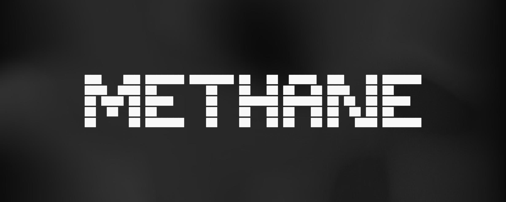

# $METHANE

**Gas-as-a-Service infrastructure for the Fartcoin ecosystem.**

Turn idle pump.fun creator fees into leveraged Fartcoin exposure. Autonomous. On-chain. Verifiable.

**[methane.capital](https://www.methane.capital)** · **[docs](https://www.methane.capital/docs)**

---

## What Is This?

$METHANE is a set of open-source tools that let any token on Solana route their creator fees into a leveraged FART position via [Lavarage](https://lavarage.xyz).

Every 15 minutes, the agent:
1. **Claims** accumulated creator fees from pump.fun
2. **Splits** — 70% to leveraged position, 30% to buyback reserve
3. **Opens** a 5× leveraged FART position on Lavarage (real token purchases, not synthetic perps)
4. **Monitors** position health, liquidation risk, and borrowing costs

No human intervention. No custody. Every transaction is public on Solscan.

## Why Lavarage?

Lavarage provides **spot leverage** — it borrows SOL against your collateral and buys real FART tokens on-chain. This creates actual buy pressure on the underlying asset, unlike perpetual futures which are synthetic.

| Feature | Lavarage | Perp DEXs |
|---------|----------|-----------|
| Token purchases | Real (on-chain) | Synthetic |
| Buy pressure | Yes | No |
| Collateral | SOL direct | USDC required |
| Permissionless | Yes | Listing required |
| Max leverage | 7.47× | Varies |

## Architecture

```
┌─────────────────────────────────────────────────┐
│                  pump.fun token                  │
│              (creator fee enabled)               │
└──────────────────┬──────────────────────────────┘
                   │ fees accumulate
                   ▼
┌─────────────────────────────────────────────────┐
│              METHANE Agent                       │
│  ┌──────────┐  ┌──────────┐  ┌───────────────┐ │
│  │ Claimer  │→ │ Splitter │→ │ Lavarage Mgr  │ │
│  │          │  │ 70/30    │  │ 5× leverage   │ │
│  └──────────┘  └──────────┘  └───────────────┘ │
│                                                  │
│  ┌──────────┐  ┌──────────┐  ┌───────────────┐ │
│  │ Redis    │  │ Pyth     │  │ Jupiter       │ │
│  │ logging  │  │ oracle   │  │ swap routing  │ │
│  └──────────┘  └──────────┘  └───────────────┘ │
└─────────────────────────────────────────────────┘
                   │
                   ▼
┌─────────────────────────────────────────────────┐
│              Lavarage Protocol                   │
│         (borrows SOL → buys FART)               │
└─────────────────────────────────────────────────┘
```

## Token Mechanics

### Burn on Rip
When the FART position hits +15% unrealized PnL, the agent takes partial profit and uses the 30% buyback allocation to purchase $METHANE tokens — then burns them permanently.

### Profit Distribution (The Blowoff)
At major PnL milestones (2×, 5×, 10×), the agent realizes 30% of gains and distributes directly to the top 500 $METHANE holders via SPL token transfer.

### Governance (Critical Mass)
Holder voting weight scales with market cap milestones:

| Market Cap | Vote Weight |
|-----------|-------------|
| $100K | 3× |
| $500K | 5× |
| $1M | 7× |

## API Endpoints

All endpoints are public. No authentication required.

### `GET /api/position`
Returns live position data from Lavarage and pipeline statistics from Redis.

```json
{
  "live": true,
  "venue": "lavarage",
  "position": {
    "hasPosition": true,
    "positions": [{
      "side": "LONG",
      "entryPrice": 0.1805,
      "currentPrice": 0.1923,
      "unrealizedPnl": 12.45,
      "roiPercent": 6.53,
      "liquidationPrice": 0.0412,
      "effectiveLeverage": 4.89
    }]
  }
}
```

### `GET /api/fart-price`
Current FART price from Pyth Network oracle.

### `GET /api/logs`
Recent agent activity log entries from Redis.

## Tech Stack

- **Frontend:** Next.js + Tailwind CSS
- **Font:** JetBrains Mono
- **Price Oracle:** Pyth Network (Hermes)
- **Leverage:** Lavarage (spot leverage protocol)
- **Swap Routing:** Jupiter
- **Logging:** Upstash Redis
- **Deployment:** Vercel

## Risks

This is not a disclaimer — it's a technical assessment of what can go wrong.

- **Liquidation:** At 5× leverage, ~20% FART price drop approaches liquidation. Agent re-enters at reduced leverage after cooldown.
- **Borrowing costs:** ~99% APR on borrowed SOL. Interest erodes positions in sideways markets. Agent auto-closes if costs exceed projected returns.
- **Smart contract risk:** Lavarage and Jupiter contracts are audited but not risk-free.
- **Market risk:** FART is a memecoin. High volatility. Leverage amplifies both gains and losses.

## Environment Variables

```env
LAVARAGE_API_KEY=        # Lavarage API key for position data
NEXT_PUBLIC_RPC_URL=     # Solana RPC endpoint (Helius recommended)
```

## Development

```bash
npm install
npm run dev
```

Open [http://localhost:3000](http://localhost:3000).

## Agent

The pipeline agent lives in a separate repo. It handles fee claiming, splitting, and position management autonomously.

## License

MIT

---

**Built by [METHANE-CAPITAL](https://github.com/METHANE-CAPITAL)**
